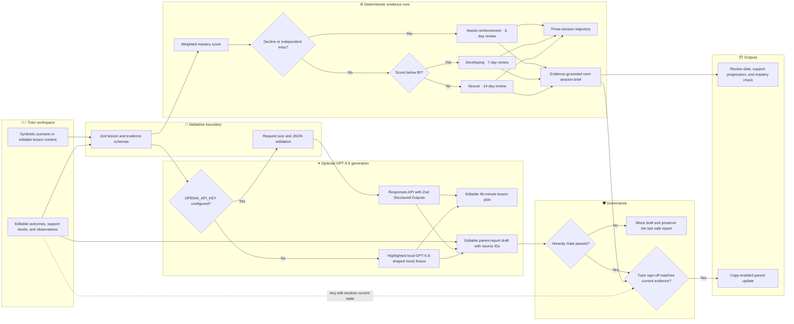

# TutorOS

**Turn tutoring-session evidence into the next teaching decision and an honest parent update.**


Independent tutors leave each session with useful observations, then manually turn them into the
next lesson, a review schedule, and a parent update. TutorOS connects those tasks: it validates an
editable evidence log, derives deterministic mastery and next-session decisions, and optionally
uses GPT‑5.6 for structured lesson plans and report drafts. Without an API key, those actions return
clearly highlighted local mock fixtures with the same validated shape. It was built by an
independent tutor for the real work that happens after every lesson.

[Try the synthetic public demo](https://tutoros-sand.vercel.app)

## Table of Contents

- [Why TutorOS](#why-tutoros)
- [Architecture](#architecture)
- [How it works](#how-it-works)
- [Built with Codex and GPT-5.6](#built-with-codex-and-gpt-56)
- [Quick Start](#quick-start)
- [Configuration](#configuration)
- [Project Structure](#project-structure)
- [Privacy and data handling](#privacy-and-data-handling)
- [Honest Status](#honest-status)
- [Roadmap](#roadmap)
- [License](#license)

## Why TutorOS

| After-session pain | TutorOS response | Verifiable implementation |
|---|---|---|
| Notes are disconnected from the next lesson. | Carries the latest difficulty and breakthrough into a next-session brief. | `deriveNextSessionBrief` preserves source attempt IDs and observations. |
| A strong average can hide a recent independent miss. | Uses outcome and support weights, then applies decline and independent-miss overrides. | `calculateMasteryDecision` returns the score, status, signals, interval, date, and reason. |
| Parent updates drift into generic praise. | Checks citations, generic praise, softened mastery language, and omitted difficulties. | `honestyGateCheck` blocks drafts that fail those rules. |
| Edited evidence can leave old outputs looking current. | Marks the trajectory, brief, report check, and sign-off stale after evidence changes. | The client workspace requires recomputation and revokes prior approval. |
| Human review can become a decorative badge. | Recomputes the brief and re-runs the Honesty Gate before enabling copy. | `createTutorSignOff` rejects stale or dishonest decision packets. |
| Product-integrity claims are hard to inspect. | Runs named synthetic fixtures against the production decision functions. | `pnpm benchmark` prints the measured pass count and every observed result. |

## Architecture



The preloaded plan and report make the full evidence workflow usable without an API key. Generation
buttons return an explicitly labeled local mock when the key is absent and a live response when it
is configured. Mastery scheduling, trajectory, provenance, the Honesty Gate, and tutor sign-off
remain deterministic in both cases.

## How it works

1. **Load a safe scenario.** The home route builds Maya's synthetic Tuesday session, derives its
   mastery decision, next-session brief, trajectory, and Honesty Gate result, then runs the evidence
   benchmark before rendering.
2. **Review or edit the lesson plan.** The sample contains a 5-minute warm-up, 20-minute core
   teaching block, 15-minute practice sequence, and 5-minute mastery check. Every teaching section
   is editable.
3. **Generate a new plan.** `POST /api/lesson-plan` validates five context fields. With a key, it
   requests a structured plan from the OpenAI Responses API. Without one, it returns a local mock
   marked with `source: "mock"`. Four practice problems progress through supported, guided,
   independent, and stretch difficulty.
4. **Record evidence.** Each attempt stores an outcome (`correct`, `partial`, or `incorrect`), a
   support level (`independent`, `prompted`, or `modeled`), and an observation.
5. **Calculate the next review.** TutorOS combines outcome and support weights. A declining
   three-attempt sequence or any incorrect independent attempt forces reinforcement and a 3-day
   review; otherwise score boundaries select a 7- or 14-day interval.
6. **Close the teaching loop.** The latest difficult attempt becomes the review target. The latest
   correct attempt becomes the breakthrough source when available. Those observations shape the
   opening retrieval task, support progression, mastery check, and optional next lesson.
7. **Show the trajectory.** Exactly three chronological sessions are recalculated through the same
   mastery function. The latest session remains the governing evidence.
8. **Draft and govern the parent update.** The preloaded report works offline. Optional live
   generation returns source attempt IDs, then the Honesty Gate checks them against the evidence.
9. **Require human sign-off.** Copy remains disabled until the current evidence, derived brief, and
   report pass sign-off together. Editing evidence or wording revokes that approval.

## Built with Codex and GPT-5.6

### How Codex was used

TutorOS was planned, implemented, tested, documented, and released through one primary Codex task:
`019f74c8-b8f0-7be3-bb77-d619e28f77cb`. The task carried the project from the education plan through
nine versioned slices—including deployment hardening—the 1.0 submission release, and the 1.1
credential-free mock fallback. Codex inspected the codebase, created focused branches and pull
requests, implemented each vertical slice, ran the release checks, and merged only after CI passed.

The repository preserves that workflow in its issue-to-PR history. The detailed model evidence and
artifact mapping are recorded in [GPT56_EVIDENCE.md](GPT56_EVIDENCE.md).

### Important decisions made with Codex

| Decision | Why it matters | Result in the repository |
|---|---|---|
| Keep mastery and scheduling deterministic. | A tutor must be able to inspect why a learner was classified and when review was scheduled. | `calculateMasteryDecision` exposes weights, overrides, status, interval, and reason. |
| Treat evidence provenance as data, not prose. | Generated wording must not invent what happened in the lesson. | Next-session briefs and reports carry exact attempt IDs and observations. |
| Put a deterministic Honesty Gate after report drafting. | Fluent output is not sufficient if it softens struggle or cites missing evidence. | `honestyGateCheck` blocks four named integrity failures before sign-off. |
| Make human approval revocable. | Editing evidence after approval must invalidate downstream decisions. | Evidence edits mark outputs stale and revoke tutor sign-off. |
| Keep the judge path credential-free. | Judges should be able to test the complete loop without secrets or a rebuild. | Missing API credentials return visibly labeled local mocks with `source: "mock"`. |
| Never present a fixture as model output. | The public demo must distinguish simulation from a live API response. | Mock banners state that no OpenAI call was made; live responses use `source: "live"`. |

### Precise GPT-5.6 contribution

The primary Codex task above was run with `gpt-5.6-sol`. Local Codex session metadata records that
model throughout the task; the same task ID is supplied in the Devpost `/feedback` field so the
organizers can verify it. GPT-5.6 in Codex helped design and implement the deterministic evidence
core, GPT-5.6 structured-output adapters, Honesty Gate, next-session provenance, benchmark,
trajectory, sign-off, release checks, and credential-free fallback.

TutorOS also contains optional server-side runtime adapters that request `gpt-5.6` for structured
lesson plans and parent reports when `OPENAI_API_KEY` is configured. The public deployment does not
have that credential. Its highlighted fallback responses are deterministic local fixtures shaped
like the validated live response, not GPT-5.6 or ChatGPT output.

### Judge test path — no rebuild, account, or API key

1. Open the [public TutorOS demo](https://tutoros-sand.vercel.app).
2. Select **Start 90-second demo** to load the synthetic Maya session.
3. Select **See the 12/12 benchmark** to inspect the named production-logic fixtures.
4. Change Attempt 4 from **Incorrect** to **Correct**, then select **Update mastery decision**.
5. Confirm the mastery state, review date, trajectory, and next-session brief change together.
6. Generate a lesson or report and confirm the purple **Mock GPT-5.6 response** notice says that no
   API call was made.
7. Open **Tutor sign-off**, approve the current packet, and confirm copying becomes available.

The deployment uses only fictional sample data and resets on reload. Judges who prefer a local run
can use the commands below, but rebuilding is not required to evaluate the submitted product.

## Quick Start

### Prerequisites

| Tool | Required version |
|---|---|
| Node.js | 24 |
| pnpm | 10 (`packageManager` pins `10.33.2`) |

### Run locally

```bash
git clone https://github.com/manojmallick/tutoros.git
cd tutoros
pnpm install
cp .env.example .env.local
pnpm dev
```

Open [http://localhost:3000](http://localhost:3000). The synthetic workflow works immediately.
Set `OPENAI_API_KEY` in `.env.local` only if you want spark-marked actions to call OpenAI. Without
it, those actions return highlighted local mocks and make no external model call.

### Verify the repository

```bash
pnpm typecheck
pnpm lint
pnpm benchmark
pnpm test
pnpm build
```

The benchmark command reports its actual total, per-category totals, and every observed result. It
exits unsuccessfully if a production-logic fixture regresses.

Validate a production environment separately:

```bash
NEXT_PUBLIC_SITE_URL=https://your-final-domain.example pnpm deployment:check
```

The deployment check requires a non-local HTTPS URL. `OPENAI_API_KEY` remains optional.

## Configuration

### Environment variables

| Variable | Default | Purpose |
|---|---|---|
| `NEXT_PUBLIC_SITE_URL` | `http://localhost:3000` | Canonical URL for metadata, robots, sitemap, health, and production-readiness checks. Production requires a non-local HTTPS URL. |
| `OPENAI_API_KEY` | Unset | Server-only credential for live generation. When unset, both endpoints return highlighted local mocks with `source: "mock"`. |
| `TUTOROS_BENCHMARK_REPORT` | Unset | Set to `1` by `pnpm benchmark` so Vitest prints the benchmark report. |
| `TUTOROS_DEPLOYMENT_CHECK` | Unset | Set to `1` by `pnpm deployment:check` so the readiness test evaluates the current environment. |

### Important in-code constants

| Variable or rule | Default | Purpose |
|---|---|---|
| `LESSON_PLAN_MODEL` | `gpt-5.6` | Model requested for structured lesson-plan generation. |
| `PARENT_REPORT_MODEL` | `gpt-5.6` | Model requested for structured parent-report generation. |
| `MOCK_GPT56_MODEL` | `gpt-5.6` | Declares the schema target shown on local mock responses; it does not represent a model call. |
| Lesson-plan output budget | `3,500` tokens | `max_output_tokens` passed to the Responses API for a lesson plan. |
| Parent-report output budget | `1,200` tokens | `max_output_tokens` passed to the Responses API for a report draft. |
| `MAX_GENERATION_REQUEST_BYTES` | `32 * 1024` bytes | Rejects declared generation requests above 32 KiB. |
| Outcome weights | Correct `1`; partial `0.5`; incorrect `0` | Converts attempt outcomes into evidence values. |
| Support weights | Independent `1`; prompted `0.8`; modeled `0.6` | Discounts success that required more tutor support. |
| Mastery boundaries | `<50`, `<80`, otherwise | Maps scores to Needs reinforcement, Developing, or Secure when no override applies. |
| Review intervals | `3`, `7`, or `14` days | Schedules reinforcement, developing retrieval, or secure retrieval in UTC. |
| Evidence limits | `1–12` attempts | Bounds a validated session evidence record. |

Live generation uses low reasoning effort. Both routes use no-store JSON responses, Zod validation,
an explicit `live` or `mock` source, and actionable `400`, `413`, `422`, or `502` errors where
applicable.

## Project Structure

```text
tutoros/
├── app/page.tsx                           # Server entry: scenario, benchmark, and derived outputs
├── app/components/lesson-plan-workspace.tsx # Editable context and lesson-plan generation
├── app/components/session-evidence-workspace.tsx # Evidence, mastery, report, and sign-off state
├── app/components/next-session-brief-panel.tsx # Deterministic brief and optional generation
├── app/components/learner-trajectory-panel.tsx # Three-session evidence trajectory
├── app/components/evidence-benchmark.tsx  # Measured fixture results
├── app/api/lesson-plan/route.ts            # Validated lesson-plan endpoint
├── app/api/parent-report/route.ts          # Validated report endpoint plus Honesty Gate
├── app/api/health/route.ts                 # Version, benchmark, URL, and capability health
├── app/privacy/page.tsx                    # Public data-handling notice
├── src/logic/mastery.ts                    # Evidence weighting, overrides, and scheduling
├── src/logic/next-session-brief.ts         # Review target, provenance, and support progression
├── src/logic/learner-trajectory.ts         # Three-session trajectory and tutor sign-off
├── src/logic/honesty-gate.ts               # Report-integrity rules
├── src/logic/lesson-plan.ts                 # Lesson request and structured-output schemas
├── src/logic/parent-report.ts               # Report request and structured-output schemas
├── src/logic/generate-lesson-plan.ts        # OpenAI lesson-plan adapter
├── src/logic/generate-parent-report.ts      # OpenAI report adapter
├── src/logic/mock-generation.ts             # Schema-valid credential-free response fixtures
├── src/logic/generation-source.ts           # Live-versus-mock response contract
├── src/logic/evidence-integrity-benchmark.ts # Named production-logic fixtures
├── src/logic/tuesday-scenario.ts            # Preloaded synthetic Maya scenario
├── lib/deployment/readiness.ts              # Canonical URL readiness contract
├── lib/deployment/security-headers.ts       # Browser security policy
├── lib/http/api-response.ts                 # Request-size and no-store response helpers
├── lib/seo/metadata.ts                      # Shared metadata
├── lib/seo/site-url.ts                      # Canonical URL fallback
├── .github/workflows/build.yml          # Install, typecheck, lint, benchmark, test, and build
├── .env.example                         # Local environment template
├── next.config.ts                       # Global security headers
└── vercel.ts                            # Vercel framework, build, and static-cache config
```

## Privacy and data handling

- The bundled Maya scenario is fictional. Do not enter real student or minor data into the public
  demo.
- This release has no account system, database, analytics tracker, or application persistence.
  Browser edits disappear when the page reloads or the demo resets.
- `OPENAI_API_KEY` is read only on the server. It is never exposed with a `NEXT_PUBLIC_` prefix.
- Without a server key, spark-marked generation runs locally and sends nothing to OpenAI. The UI
  labels and highlights every mock response.
- With live generation configured, spark-marked actions send the submitted tutoring context from
  the TutorOS server to OpenAI.
- API responses use `Cache-Control: no-store`. Generated drafts are not sent to parents
  automatically.
- A tutor must review and sign off the current packet before the parent update can be copied.

See the in-app [privacy notice](https://tutoros-sand.vercel.app/privacy) for the public deployment
wording.

## Honest Status

TutorOS 1.1 is a runnable, public demonstration built around synthetic data. Its deterministic path
works without credentials. Generation buttons fall back to local GPT‑5.6-shaped fixtures when no
key is configured; these are simulations, not outputs produced by ChatGPT or the OpenAI API. Live
lesson and report generation requires an OpenAI API key.

The mastery scheduler is a transparent product heuristic. It is not a validated learning-science
model, diagnostic instrument, or guarantee of student outcomes. The Evidence Integrity Benchmark
tests software behavior with synthetic adversarial fixtures; it does not measure educational
efficacy. There is currently no multi-user support, durable history, account system, or workflow for
handling real learner records.

## Roadmap

These are proposed next steps, not shipped commitments:

- [ ] Evaluate the mastery heuristic with working tutors before changing its score boundaries or
  review intervals.
- [ ] Expand adversarial fixtures for stale artifacts, edited reports, provenance, and sign-off.
- [ ] Add automated browser coverage for the credential-free flow and optional generation errors.
- [ ] Design consent, retention, deletion, and access controls before adding persistence or real
  learner records.
- [ ] Add authenticated, durable session history only after the privacy model is defined and
  reviewed.

## License

Licensed under the [MIT License](LICENSE). Copyright © 2026 Manoj Mallick.
